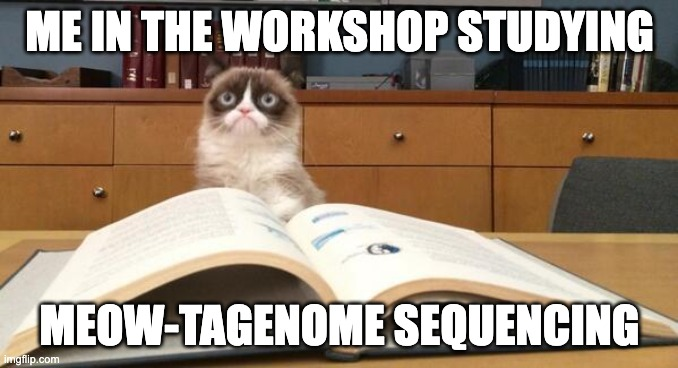

Hey everyone, buckle up for a whirlwind tour of the amazing world of genomics!  I recently had the mind-blowing opportunity to participate in a one-month Genome Informatics workshop organized by the incredible Decode Life. And let me tell you, it was a game-changer! 

## From GWAS to Bisulphite Sequencing: A Deep Dive into Cutting-Edge Techniques

This workshop wasn't just about learning the alphabet of DNA; it was about diving headfirst into the cutting-edge tools and techniques that are pushing the boundaries of genomic research.  Here's a taste of what I geeked out on:

- **GWAS (Genome-Wide Association Studies):** Imagine playing detective, but instead of fingerprints, you're analyzing DNA to uncover the genetic clues behind complex traits and diseases.

- **Shotgun Metagenome Sequencing:** Think of it as putting together a giant jigsaw puzzle of an entire ecosystem's DNA, one tiny fragment at a time.

- **RNAseq Analysis:** This technique lets you see what genes are actually working overtime in a cell, giving us a glimpse into the inner workings of life.

- **Amplicon-Based Sequencing:** Need a specific answer about a particular part of the genome? This is like zooming in on a specific piece of the puzzle for a closer look.

- **Whole Genome Annotation:** It's like labeling all the important features on a map of the genome, making it easier to navigate and understand.

- **Whole Genomics Bisulphite Sequencing:** This fancy technique lets you see how DNA methylation, a chemical switch that can turn genes on or off, is happening across the entire genome. 

## From Learning to Doing: Shaping My Future with Practical Skills

This workshop wasn't just lectures and slides; it was hands-on learning with real data and powerful tools.  I got to experiment, analyze, and interpret genomic data, giving me a deeper understanding of these powerful techniques and the questions they can answer. 

**But wait, there's more!**  As some of you know, I'm also developing a web application called AutophiGen, which automates simple phylogenetic analysis.  Exciting news: the front-end development is almost complete!  Stay tuned for more updates on this project as I integrate the knowledge and skills gained from the workshop. 

## Let's Connect and Explore the Fascinating World of DNA!

This workshop has ignited a passion for genomics within me, and I'm eager to share it with all of you!  Let's connect and discuss:

* What are your thoughts on the latest advancements in genomics?
* What questions do you have about DNA and its role in health, disease, and evolution?
* Are you interested in learning more about specific techniques or tools?

Share your insights, ask questions, and let's explore the fascinating world of DNA together! 

**P.S.** As promised, here's your obligatory cat meme to brighten your day: 

Remember, knowledge is power, and when it comes to understanding the blueprint of life, that power is in all of our hands.  Let's use it to make amazing discoveries together! 

**Stay curious, stay awesome, and stay tuned for more genomics adventures!**
