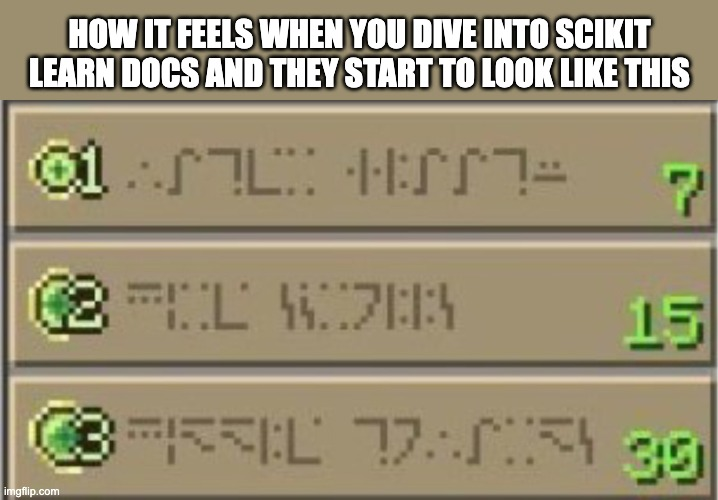

Hey folks,  

This week, I experienced what I can only describe as a *neural net crash*—my brain hit maximum capacity while trying to decipher **Scikit-learn**. I was tweaking hyperparameters, throwing data at algorithms, and reading docs like my life depended on it, but deep down, I knew I was brute-forcing it.  

That’s when I realized I was missing something fundamental: *I didn’t understand why anything worked.*  

Instead of frustrating myself further, I decided to take a step back and focus on the basics. It’s easy to get caught up in the "just use the library" mindset, but without understanding the concepts, it feels like trying to assemble a *Jugadu jugaad* science project at the last minute—chaotic, desperate, and occasionally involving glue that doesn’t stick.  

---

### **What I’m Learning**  

I’ve decided to explore the conceptual side of **AI and ML** before jumping back into tools. Here’s what’s on my plate this week:  

1. **Probability & Uncertainty**  
   Machines need to handle unpredictability. I’m delving into how algorithms deal with incomplete or ambiguous data. Turns out, probability theory is the secret sauce behind a lot of AI magic.  

2. **Algorithmic Thinking**  
   Breadth-first search, depth-first search, Minimax, and decision trees—these aren’t just textbook terms. They’re strategies that make AI "intelligent." Understanding them helps demystify how machines make decisions.  

3. **Logic Foundations**  
   Propositional logic and first-order logic are like the grammar of AI—without them, you’re just mumbling to your machine. I’m learning how to frame problems logically so algorithms can process them effectively.  

4. **Core Concepts of Learning**  
   How do algorithms learn patterns? What’s the role of optimization, and how do loss functions shape the outcome? These are the questions I’m tackling to ensure I’m building a strong foundation for future work.  

---

### **Why Take This Approach?**  

I realized I was rushing ahead, applying tools without understanding their mechanics. It’s tempting to throw data into a model, tweak a few parameters, and call it a day, but real learning comes from knowing *why* and *how*.  

This detour isn’t a setback—it’s an investment in clarity. By diving into these concepts, I’ll return to Scikit-learn with more confidence and less confusion.  

---

### **What I’ve Learned So Far**  

1. **Mastering the Basics**  
   AI and ML are built on a strong theoretical foundation. Skipping the basics is like trying to deliver a 5-star biryani when you’ve only mastered instant noodles.  

2. **Patience is Key**  
   Progress isn’t always linear. It’s okay to take two steps back to leap forward later.  

3. **Embrace the Struggle**  
   Learning is messy, and that’s okay. Struggles mean you’re growing, even if it feels like your brain is doing the *cha-cha* with uncertainty.  

---

### **A Little Humor to Wrap It Up**  

Here’s what my learning journey feels like:  

  

---

### **What’s Next?**  

In the coming weeks, I plan to revisit Scikit-learn armed with better fundamentals. My goal is to transition from feeling like I’m fighting with code to working with it.  

If you’ve ever felt overwhelmed while learning AI or have resources that helped you, I’d love to hear about them. Let’s share our struggles and victories—because this journey is better with community and a good laugh.  

Until next time,  
Adnan